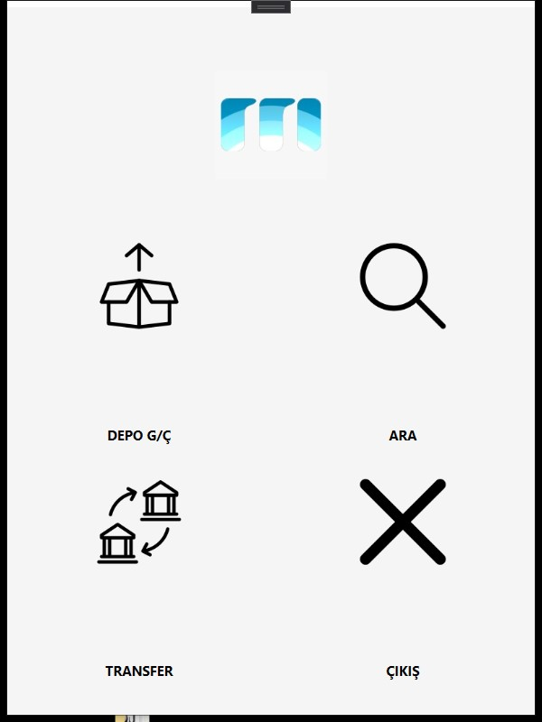
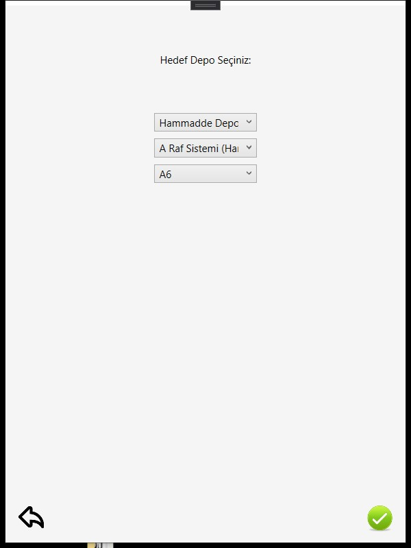
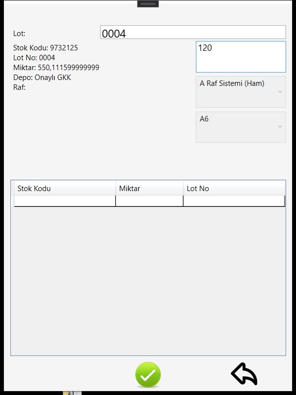
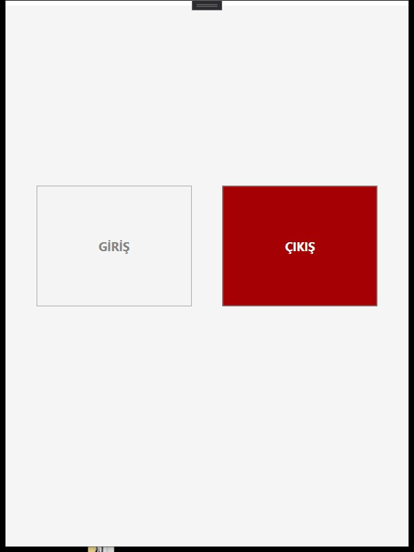
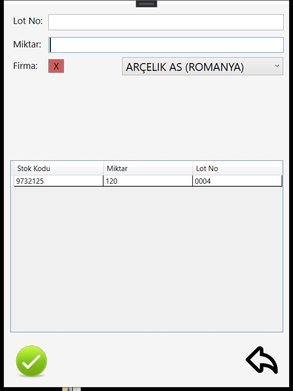
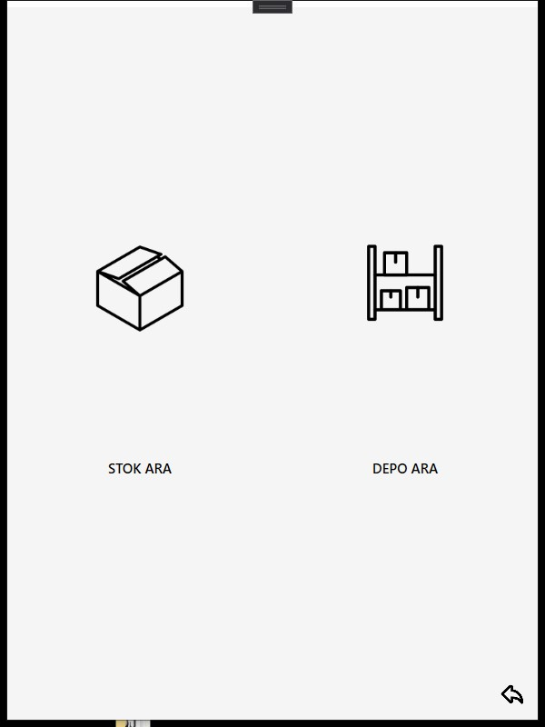

# Warehouse Management App Screenshots

This app is a Windows application created with WPF for hand terminals/tablets in facilities. The app uses ERP program-created data to manage/show. 

Application works with a service which is run on IIS and sends requests to this service to send and gather data.

**App is in use by firms because of this I will publish the codes when it is available.**

## Main Goal Of The Project

Goal of the app is managing items in the warehouses with a remote terminal. 

For example, user scans barcode in label on the crates and change the location of this item in the system or send the crate to the warehouse exit zone to be processed; in this step, person on the ERP program can see the crate and prepare a bill of sale. 

Other features of the program are to show which items are found in the area or on the shelf and in which areas or shelves the selected item is found. 

## Preview of the App

| Image | Description |
| --- | --- |
|  | *Image 1   This is the main page of the app. It has three sections; in/out operations, transfer operations, search operations and an exit button.* |
|  | *Image 2   This is the transfer page-1. User is asked for destination warehouse that he/she want to transfer the items.* |
|  | *Image 3   This is the transfer page-2. User scans the barcode on the label and information of the item comes. Later user decides how many/much of it will be transported. When quantity is set, item goes into the list waiting to be accepted.  User can see the destination warehouse also.* |
|  | *Image 4   This is the in/out operation choice page. User is asked for whether he/she will make an in or out operation for the warehouse.* |
|  | *Image 5   This is the out operation page. User will scan the barcode on the label, enter the amount and choose a firm to make an exit operation from warehouse. If everything is correct, app will send the informations to the ERP system and a bill of sale can be created.* |
|  | *Image 6   This is the search item or warehouse choice page. User will be asked whether he/she want to search an item or a rack/area. - If user choose item, item code will be asked and app show the racks/areas where this item exists. - If user choose warehouse, app will ask for which rack/area user wants to see and show items in it.* |

